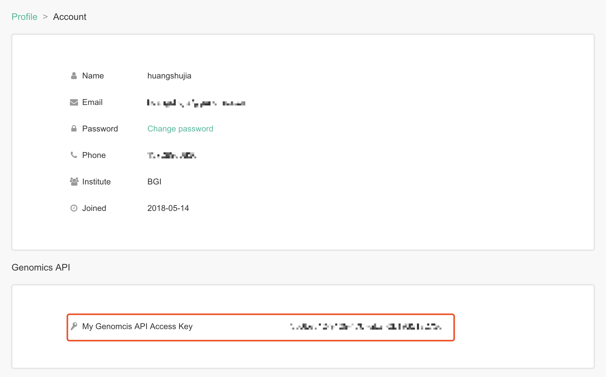

# cmdbtools: A command line tools for CMDB varaints browser

## Introduction

China is the most populous country and the second largest economy in the world. However, 
the construction of Chinese genome database is in slow progress. At present, among the 
world's large-scale international and national genome sequencing projects, such as 1KGP, 
Genomics England, Genome of the Netherlands, ExAC are mostly biased towards the construction
of a genomic baseline for European populations. In those projects, while the sample size goes
up to hundreds of thousands for samples with european ancestry in those database, the sequen-
cing Chinese samples is no more than a thousand.

Since a high-quality genomic baseline database serves as an important control for medical 
research and population-oriented clinical and drug applications, the Chinese millionome
database (CMDB) is developed to fill the gap.

The [Chinese Millionome Database(CMDB)](https://db.cngb.org/cmdb/) is a unique large-scale 
Chinese genomics database produced by BGI and hosted in the National GeneBank. The CMDB delivers
peridical and useful variation information and scientific insights derived from the analysis of
millions of Chinese sequencing data. The results aim to promote genetic research and precision
medicine actions in China.

The delivering information includes any of detected variants and the corresponding allele frequency,
annotation, frequency comparison to the global populations from existing databases, etc.

Benchmarking detail and methods are described in our *Cell* paper:

Liu, S. et al.(2018) Genomic Analyses from Non-invasive Prenatal Testing Reveal Genetic Associations, 
Patterns of Viral Infections, and Chinese Population History. *Cell*, 2, 347-359. 
[DOI:https://doi.org/10.1016/j.cell.2018.08.016](https://doi.org/10.1016/j.cell.2018.08.016)

**cmdbtools** is a command line tool for this CMDB variants browser.

## Tutorial

CMDB variant browser allows authorized access its data through an Genomics API and **cmdbtools** 
is a convenient command line tools for this purpose.

## Installation

You can install the development version from github for this moment, by running:

```bash
pip install git+git://github.com/ShujiaHuang/cmdbtools.git#egg=cmdbtools
```

## Setup

Please enable your API access from Profile in [CMDB browser](https://db.cngb.org/cmdb) before using **cmdbtools**. 

## Login

Login with `cmdbtools` first by using CMDB API access key, which could be found from Profile->Genomics API if you have apply for it.



```bash
cmdbtools login -k your-genomics-api-key
```

If success, that means you can use CMDB as one of your varaints database in command line mode.

## Query a single variant

A single variant can be retrieved from CMDB by using `query-varaint`.

Run `cmdbtools query-variant -h` to see all available options.

Here is an example for quering a varaint by chromosome name and position.

```bash
cmdbtools query-variant -c chr17 -p 41234470
```

and you will get something looks like below:

```bash
##fileformat=VCFv4.2
##FILTER=<ID=LowQual,Description="Low quality">
##INFO=<ID=CMDB_AN,Number=1,Type=Integer,Description="Number of Alleles in Samples with Coverage from CMDB_hg19_v1.0">
##INFO=<ID=CMDB_AC,Number=A,Type=Integer,Description="Alternate Allele Counts in Samples with Coverage from CMDB_hg19_v1.0">
##INFO=<ID=CMDB_AF,Number=A,Type=Float,Description="Alternate Allele Frequencies from CMDB_hg19_v1.0">
##INFO=<ID=CMDB_FILTER,Number=A,Type=Float,Description="Filter from CMDB_hg19_v1.0">
#CHROM	POS	ID	REF	ALT	QUAL	FILTER	INFO
17	41234470	rs1060915&CD086610&COSM4416375	A	G	74.38	PASS	CMDB_AF=0.361763,CMDB_AC=4625,CMDB_AN=12757
```

## Annotate your VCF files

You can annotate you VCF file with CMDB information by using `cmdbtools annotate` command.

Download a list of example variants in VCF format from [multiple_samples.vcf.gz](tests/multiple_samples.vcf.gz).
To annotate this list of variants with allele frequences from CMDB, you can just run the following command on Linux or Mac OS.

```bash
cmdbtools annotate -i multiple_samples.vcf.gz > multiple_samples_CMDB.vcf
```

It'll take about 2 or 3 mins to complete about 3,000 variants' annotation.

After that you will get 4 new fields of CMDB's annotate information in VCF INFO:

* `CMDB_AF`: Allele frequece in CMDB;
* `CMDB_AN`: Coverage in CMDB in population level;
* `CMDB_AC`: Allele count in population level in CMDB;
* `CMDB_FILTER`: Filter status in CMDB

```bash
##fileformat=VCFv4.2
##ALT=<ID=NON_REF,Description="Represents any possible alternative allele at this location">
##FILTER=<ID=LowQual,Description="Low quality">
##INFO=<ID=AC,Number=A,Type=Integer,Description="Allele count in genotypes, for each ALT allele, in the same order as listed">
##INFO=<ID=AF,Number=A,Type=Float,Description="Allele Frequency, for each ALT allele, in the same order as listed">
##INFO=<ID=AN,Number=1,Type=Integer,Description="Total number of alleles in called genotypes">
##INFO=<ID=BaseQRankSum,Number=1,Type=Float,Description="Z-score from Wilcoxon rank sum test of Alt Vs. Ref base qualities">
##reference=file:///home/tools/hg19_reference/ucsc.hg19.fasta
##INFO=<ID=CMDB_AN,Number=1,Type=Integer,Description="Number of Alleles in Samples with Coverage from CMDB_hg19_v1.0">
##INFO=<ID=CMDB_AC,Number=A,Type=Integer,Description="Alternate Allele Counts in Samples with Coverage from CMDB_hg19_v1.0">
##INFO=<ID=CMDB_AF,Number=A,Type=Float,Description="Alternate Allele Frequencies from CMDB_hg19_v1.0">
##INFO=<ID=CMDB_FILTER,Number=A,Type=Float,Description="Filter from CMDB_hg19_v1.0">
#CHROM  POS     ID      REF     ALT     QUAL    FILTER  INFO
chr21   9413612 .       C       T       6906.62 .       AC=25;AF=0.313;AN=80;BaseQRankSum=0.425;CMDB_AC=2459;CMDB_AF=0.207525;CMDB_AN=11834;CMDB_FILTER=PASS
chr21   9413629 .       C       T       8028.88 .       AC=30;AF=0.375;AN=80;BaseQRankSum=-1.200e+00;CMDB_AC=6906;CMDB_AF=0.305445;CMDB_AN=22406;CMDB_FILTER=PASS
chr21   9413700 .       G       A       7723.82 .       AC=30;AF=0.375;AN=80;BaseQRankSum=-9.000e-02
chr21   9413735 .       C       A       10121.72        .       AC=35;AF=0.438;AN=80;BaseQRankSum=0.977;CMDB_AC=2385;CMDB_AF=0.283965;CMDB_AN=8382;CMDB_FILTER=PASS
chr21   9413839 .       C       T       8192.08 .       AC=28;AF=0.350;AN=80;BaseQRankSum=-5.200e-02
chr21   9413840 .       C       A       11514.35        .       AC=38;AF=0.475;AN=80;BaseQRankSum=0.253
chr21   9413870 .       T       C       7390.60 .       AC=26;AF=0.325;AN=80;BaseQRankSum=-4.270e-01
chr21   9413880 .       T       A       146.96  .       AC=1;AF=0.013;AN=80;BaseQRankSum=2.12;ClippingRankSum=0.00
chr21   9413909 .       G       A       1131.78 .       AC=10;AF=0.125;AN=80;BaseQRankSum=0.549;CMDB_AC=209;CMDB_AF=0.01507;CMDB_AN=13683;CMDB_FILTER=PASS
chr21   9413913 .       C       T       8120.65 .       AC=28;AF=0.350;AN=80;BaseQRankSum=-4.390e-01;CMDB_AC=2870;CMDB_AF=0.205597;CMDB_AN=13955;CMDB_FILTER=PASS
chr21   9413945 .       T       C       43787.68        .       AC=71;AF=0.888;AN=80;BaseQRankSum=0.089
chr21   9413995 .       C       T       9632.44 .       AC=29;AF=0.363;AN=80;BaseQRankSum=0.747
chr21   9413996 .       A       G       41996.48        .       AC=71;AF=0.888;AN=80;BaseQRankSum=-1.242e+00;CMDB_AC=3308;CMDB_AF=0.688533;CMDB_AN=4790;CMDB_FILTER=PASS
chr21   9414003 .       T       C       4256.54 .       AC=19;AF=0.238;AN=80;BaseQRankSum=-6.030e-01
```

## Citation

**If you use CMDB in your scientific publication, we would appreciate citation this paper:**

Siyang Liu, Shujia Huang. et al.(2018) Genomic Analyses from Non-invasive Prenatal Testing Reveal Genetic Associations, 
Patterns of Viral Infections, and Chinese Population History. *Cell*, 2, 347-359. 
[DOI:https://doi.org/10.1016/j.cell.2018.08.016](https://doi.org/10.1016/j.cell.2018.08.016)
